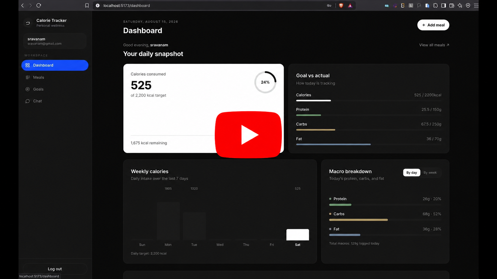

# Calorie Tracker

[](https://youtu.be/7BRMnd3B2AQ)

Full stack app for logging meals and tracking daily calories / macros. You can also set goals, upload a food photo to fill nutrition values, import meals from a PDF, and use the chat page to log food in normal language.

Frontend is React + Vite. Backend is Express + MongoDB. Auth uses JWT in an http-only cookie. Image extract and chat use Gemini.

## What is done

Required:

- Goal setting — daily calorie, protein, carb, fat targets and a weight goal. A default goal is created on signup.
- Meal entry — breakfast, lunch, dinner, snacks. Food name, quantity (grams), calories, macros, micros.
- Time-range listing — meals page with date range, meal type filter, search, and pagination.
- Nutrition reports — dashboard with weekly calorie trend, macros by day/week, micronutrient summary, and goal vs actual.
- AI calorie extraction — upload a food photo or nutrition label, Gemini fills the meal form.

Bonus:

- Chat — log meals, check goals, ask nutrition questions, and get a weekly summary in natural language (Gemini tools).
- Multi-user — signup / signin, JWT cookie, each user only sees their own data.
- Bulk import — upload a tabular PDF and import meal rows. Sample file is in `samples/`.

## What you need

- Node.js (18+)
- MongoDB running locally, or an Atlas URI
- Gemini API key (image extract + chat). One key is enough if you put it in both env vars.

## Setup

Clone the repo and create env files first.

```bash
git clone https://github.com/SravanamCharan20/calorie_tracker
cd Calorie_tracker
```

`backend/.env`

```
MONGO_URL=mongodb://127.0.0.1:27017/calorie_tracker
JWT_SECRET=change_this
GEMINI_API_KEY=your_key
GEMINI_CHAT_API_KEY=your_key
PORT=6969
```

`frontend/.env`

```
VITE_BASE_URL=http://localhost:6969
```

Backend:

```bash
cd backend
npm install
npm run dev
```

Frontend (new terminal):

```bash
cd frontend
npm install
npm run dev
```

Open http://localhost:5173, sign up, then you can use dashboard / meals / goals / chat.

`npm start` in backend runs without nodemon. Frontend: `npm run build` then `npm run preview` if you want a production build locally.

## Assumptions

- MongoDB is already running before you start the backend.
- CORS is set to `http://localhost:5173` only, so keep the Vite default port.
- Backend port is 6969 unless you change `PORT` and `VITE_BASE_URL` together.
- Quantity is stored in grams.
- PDF import expects rows with meal type, food name, quantity, calories, protein, carbs, fat. There is a sample under `samples/` and `frontend/public/samples/`.
- If Gemini keys are missing or quota is used up, meal CRUD still works. Image extract and chat will fail.
